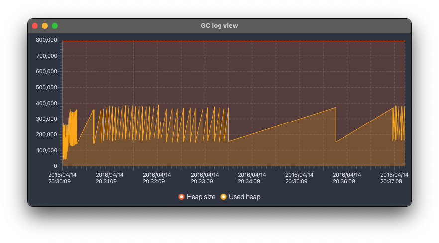

# gclog-view

A simple viewer for GC log files.




## Usage

- Drop a GC log file onto the window, or press Ctrl(⌘) + o to select a log file.
- You can zoom in and out of the graph with Ctrl(⌘) + mouse wheel.
- You can pan the graph by dragging it or using the left and right arrow keys.


## Building

To build the application from source, run the following commands:

```shell
git clone https://github.com/naotsugu/gclog-view.git
cd gclog-view
./gradlew clean build
```

To run the application directly from the source, use:

```shell
./gradlew run
```
